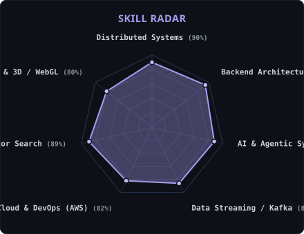
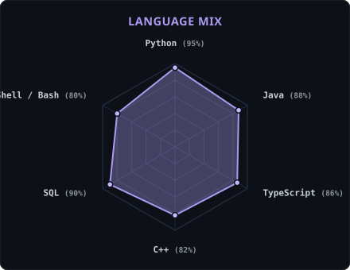
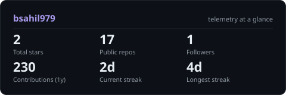
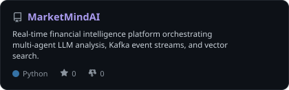
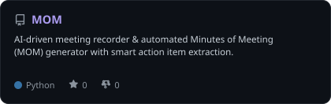

<!-- BANNER - terminal profile.sh --live -->
<picture>
  <source media="(prefers-color-scheme: dark)"  srcset="assets/banner-dark.v10.svg">
  <source media="(prefers-color-scheme: light)" srcset="assets/banner-light.v10.svg">
  
</picture>

 

<!-- NAME / TAGLINE - animated typing -->

 

<!-- SOCIALS -->
&nbsp;&nbsp;
&nbsp;&nbsp;
&nbsp;&nbsp;

 

---

## This is me :)

Hi, I'm **Sahil Belchada**, a software engineer and distributed systems builder from Mumbai, India 🇮🇳.
I specialize in architecting high-throughput data streaming pipelines, low-latency microservices, and autonomous multi-agent AI systems that turn raw computational models into real-world impact.

- 🚀 **MarketMind AI**: Engineered an end-to-end real-time financial intelligence platform orchestrating multi-agent LLM analysis, Kafka event streaming, and pgvector semantic retrieval.
- ⚡ **Backend & Scalability**: Designing resilient microservices with **FastAPI**, **Spring Boot**, **PostgreSQL**, and sub-millisecond **Redis** caching layers.
- 🤖 **Applied AI & Agentic Workflows**: Passionate about autonomous agent architectures, LangChain, RAG orchestration, and fine-tuning models for domain-specific automation.
- 🌐 **Interactive Engineering**: Pairing low-level systems precision with cinematic web experiences ([sahilbelchada.dev](https://sahilbelchada.dev)) powered by Three.js and custom Motion physics.
- 🌱 **My mission**: Engineering software that remains deterministic, fault-tolerant, and performant at scale while creating intuitive, accessible technology.
- 💬 Let's connect on **distributed systems, real-time event streams, or AI agent architectures**!

 

## my perfect stack

---

## signals

<table>
<tr>
<td width="50%" align="center" valign="middle">

<!-- Self-rated radar - edit assets/skills.json, the workflow redraws it -->
<picture>
  <source media="(prefers-color-scheme: dark)"  srcset="assets/radar-dark.svg">
  <source media="(prefers-color-scheme: light)" srcset="assets/radar-light.svg">
  
</picture>

</td>
<td width="50%" align="center" valign="middle">

<!-- Language stack radar - edit assets/langmix.json -->
<picture>
  <source media="(prefers-color-scheme: dark)"  srcset="assets/radar-langs-dark.svg">
  <source media="(prefers-color-scheme: light)" srcset="assets/radar-langs-light.svg">
  
</picture>

</td>
</tr>
</table>

---

## Numbers matter? ohhh yes.

<!-- Generated by scripts/cards.py into this repo. Standalone SVGs with zero external API downtime -->
<picture>
  <source media="(prefers-color-scheme: dark)"  srcset="assets/card-stats-dark.svg">
  <source media="(prefers-color-scheme: light)" srcset="assets/card-stats-light.svg">
  
</picture>

  

<table>
<tr>
<td width="50%" align="center" valign="middle">
<a href="https://github.com/bsahil979/MarketMindAI">
<picture>
  <source media="(prefers-color-scheme: dark)"  srcset="assets/card-MarketMindAI-dark.svg">
  <source media="(prefers-color-scheme: light)" srcset="assets/card-MarketMindAI-light.svg">
  
</picture>
</a>
</td>
<td width="50%" align="center" valign="middle">
<a href="https://github.com/bsahil979/MOM">
<picture>
  <source media="(prefers-color-scheme: dark)"  srcset="assets/card-MOM-dark.svg">
  <source media="(prefers-color-scheme: light)" srcset="assets/card-MOM-light.svg">
  
</picture>
</a>
</td>
</tr>
</table>

---

` Built with precision & passion · Sahil Belchada `

